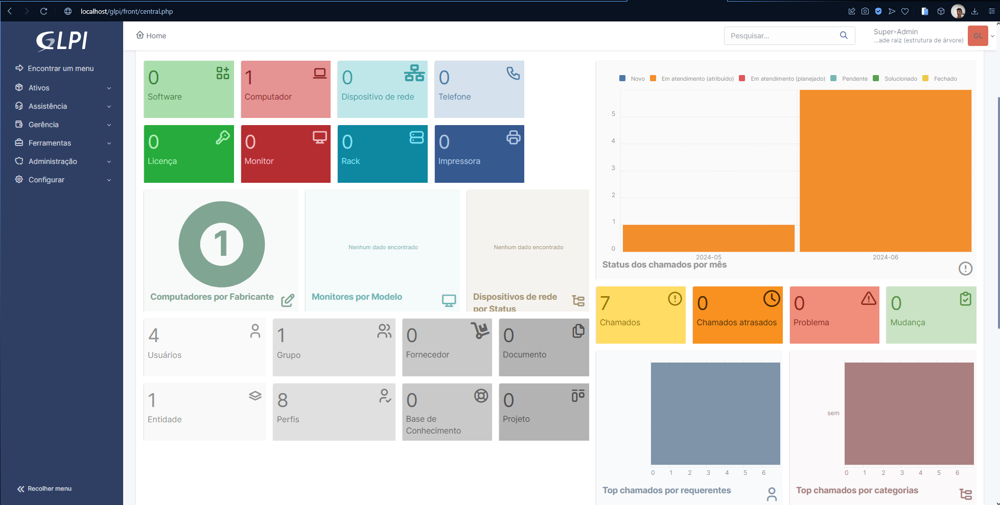

# Introdução ao GLPI
O GLPI (Gestionnaire Libre de Parc Informatique) é um sistema poderoso de gerenciamento de TI que permite adicionar ativos, gerenciar chamados, criar usuários, entre outras funcionalidades essenciais para a administração eficiente de um ambiente de TI. Este guia detalha o processo de instalação do GLPI, destacando três métodos básicos: XAMPP, WSL e VirtualBox. Vamos nos concentrar na instalação utilizando o XAMPP.

## Instalação do GLPI

### Métodos de Instalação
- XAMPP: Uma distribuição fácil de instalar que inclui Apache, PHP, MySQL e Perl.
- WSL: Subsistema Windows para Linux.
- VirtualBox: Uma VM que representa um computador físico.

#### Meu Processo de Instalação e Configuração
- Primeiro Passo: Instalar o XAMPP
    - Optei pelo XAMPP para ver como ele executaria o GLPI. Baixe e instale o XAMPP do site oficial. Escolhi a versão para Windows:

    | Versão |	Soma de verificação	| Tamanho |
    |--------|----------------------|---------|
    | 8.0.30 | PHP 8.0.30	md5 sha1 |	144 MB|

Depois de instalar o XAMPP, baixe a versão mais recente do GLPI, que atualmente é a 10.0.15. Agora, temos tudo o que precisamos para começar.

- Segundo Passo: Configurar o GLPI
    - Extraia a pasta do GLPI e mova-a para a pasta htdocs dentro do diretório do XAMPP. Isso permitirá que o XAMPP utilize as funcionalidades do GLPI.

- Terceiro Passo: Resolver Problemas de Porta
    - Se o MySQL do XAMPP estiver em conflito com outro serviço usando a porta 3306, será necessário mudar a porta para 3307:

    - No XAMPP Control Panel, vá em Config no módulo MySQL e edite o arquivo my.ini. Altere todas  as ocorrências de 3306 para 3307.
    - Faça o mesmo no arquivo php.ini no módulo Apache.
    - Reinicie os serviços para aplicar as mudanças.
- Quarto Passo: Iniciar o GLPI
    - Inicie os módulos Apache e MySQL no XAMPP e abra o navegador com a URL http://localhost/glpi. A partir daqui, siga as instruções de configuração do GLPI:

        - Idioma: Escolha o idioma de sua preferência.
        - Licença: Aceite os termos de licença.
        - Instalação: Escolha a opção de instalação.
- Quinto Passo: Verificar Dependências
    - Se faltar alguma dependência como gd e intl, descomente essas extensões no arquivo php.ini e reinicie os serviços.

- Sexto Passo: Configurar Banco de Dados
    - Configure a conexão com o banco de dados:

        - Endereço do servidor	Usuário SQL	Senha
        - localhost	root	(deixe em branco)
        - Sétimo a Décimo Passo: Finalizar Configuração
        - Crie um banco de dados.
        - Autorize a criação do banco de dados.
        - Coleta de dados.
        - Use o GLPI.
        - Acesso ao Sistema
        - Utilize as credenciais abaixo para entrar como administrador:

        Nome de usuário	Senha
        glpi	glpi
Após completar esses passos, seu sistema GLPI estará pronto para uso.

- Conclusão

Seguindo este guia, você poderá instalar e configurar o GLPI usando o XAMPP. Com isso, terá um sistema robusto para gerenciar os ativos e serviços de TI de forma eficiente.

## Resultado

### Home 

### Chamados
