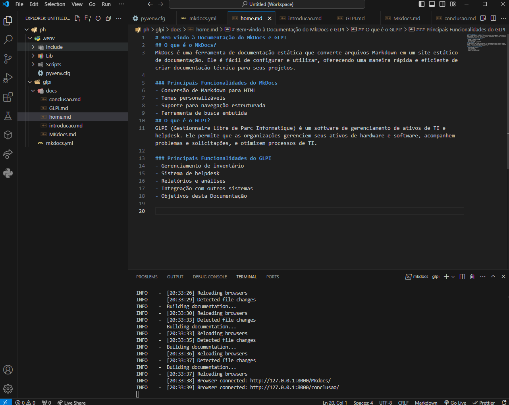

# Introdução ao MkDocs
MkDocs é uma ferramenta de geração de sites estáticos projetada especificamente para criar documentação de projetos. Desenvolvido em Python, o MkDocs é apreciado por sua simplicidade e eficiência, permitindo que desenvolvedores e equipes técnicas produzam e mantenham documentação de alta qualidade com o mínimo de esforço. Durante nosso período de estudos, utilizamos MkDocs para documentar detalhadamente os sistemas que exploramos.

## Instalação do MkDocs
- Primeiro Passo: Preparação do Ambiente
    - Antes de instalar o MkDocs no Windows, certifique-se de ter o Python e o pip instalados. Se precisar de instruções detalhadas sobre como fazer isso, CLIQUE AQUI. Verifique se eles estão instalados corretamente executando os comandos python --version e pip --version no terminal. Se as versões aparecerem, significa que Python e pip estão prontos para uso.

- Segundo Passo: Instalação do MkDocs
    - Abra o PowerShell como administrador e execute o comando:
    
        `` shell ``

        `` Copiar código`` 

        `` pip install mkdocs ``

        Isso instalará o MkDocs, tornando seus comandos disponíveis para criar novos projetos de documentação.

- Terceiro Passo: Criação de um Novo Projeto
    - Para criar um novo projeto MkDocs, execute o comando:

        ``shell``

        ``Copiar código``

        ``mkdocs new my-project``

    - Em seguida, entre no diretório do projeto criado:

        ``shell``

        ``Copiar código``

        ``cd my-project``

- Quarto Passo: Servindo o Projeto
    - Para visualizar seu projeto no navegador, utilize o comando:

        ``shell``

        ``Copiar código``

        ``mkdocs serve``

    - Isso iniciará um servidor local. Copie a URL fornecida e cole no navegador para visualizar a documentação.

- Quinto Passo: Configuração do Tema
    - Antes de ajustar o arquivo mkdocs.yml, você pode optar por usar um tema personalizado. Um tema popular é o MkDocs Material. Para instalá-lo, execute:

    ``shell``

    ``Copiar código``

    ``pip install mkdocs-material``

Agora você pode aproveitar as funcionalidades avançadas que o tema Material oferece para aprimorar sua documentação.

### Tela MkDocs no VScode

